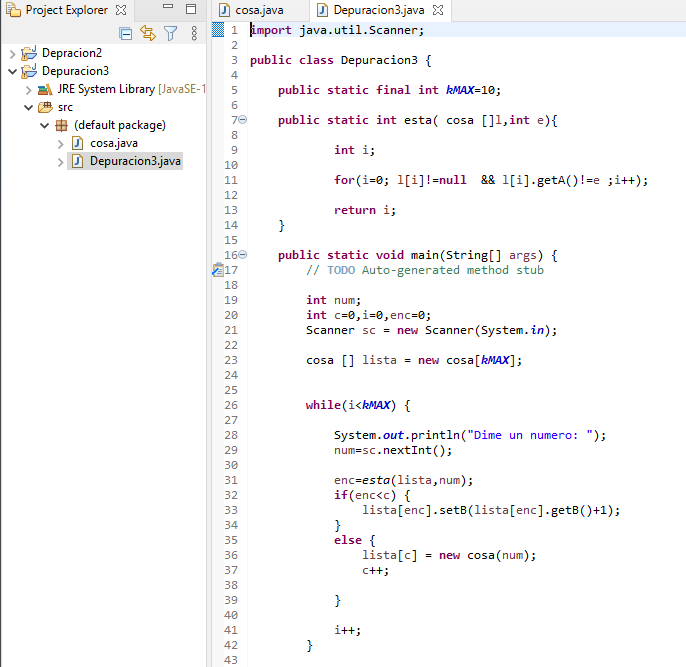
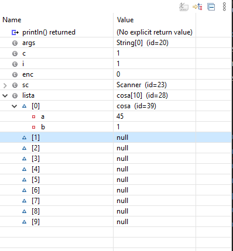

# Tarea 6 Depuracion

###### Jorge Jankovich Ramos - 2021

#### Cread un directorio Tarea6-GIT dentro de vuestro repositorio de Entornos. O si no lo tenéis, como repositorio local.

#### 0. Importar el proyecto en vuestro WorkSpace de Eclipse.
 

#### 1. Explicar QUÉ HACE EL MÉTODO MAIN.
 ##### Crea una lista con la longitud del valor final de kMAX y nos pide números que introduce en el vector.
 
 
 
#### 2. Poner un punto de ruptura (breakpoint) en la línea 26 (primer bucle del método main) y, basándonos en los valores que van tomando las variables, explicad qué hace y cómo funciona el método. Podéis crear tablas para ver cómo cambian los valores de las variables y del array. 

Cuando metes un numero por teclado, revisa si el numero se ha introducido anteriormente, e introduce un string con el valor que introducimos y las veces que se ha introducido el mismo valor.

 
#### 3. Basándoos en el funcionamiento, determinad qué indican o a qué hacen referencia las variables “a” y “b” de la clase “cosa”.
A hace referencia al valor que introducimos por teclado y B las veces que repetimos el valor de A.